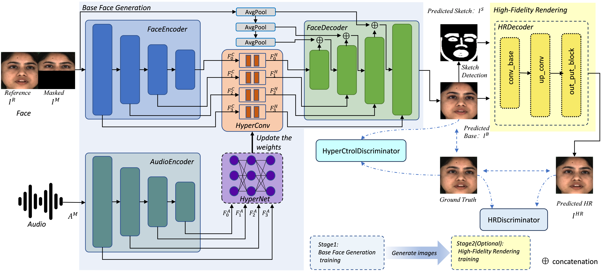

# HyperLips: Hyper Control Lips with High Resolution Decoder for Talking Face Generation
Pytorch official implementation for our  paper "HyperLips: Hyper Control Lips with High Resolution Decoder for Talking Face Generation".



[[Paper]](https://arxiv.org/abs/2305.08293) [[Demo Video]](https://www.youtube.com/watch?v=j4GdJoTF0wY)

## Requirements
- Python 3.8.16
- torch 1.10.1+cu113
- torchvision 0.11.2+cu113
- ffmpeg

We recommend to install [pytorch](https://pytorch.org/) firstly，and then install related toolkit by running
```
pip install -r requirements.txt -i https://mirrors.aliyun.com/pypi/simple
```
You also can use environment.yml to install relevant environment by running
```
conda env create -f environment.yml
```
## Getting the weights
Download the pre-trained models from [OneDrive](https://1drv.ms/f/s!Amqu9u09qiUGi7UJIADzCCC9rThkpQ?e=P1jG5N) or [jianguoyun](https://www.jianguoyun.com/p/DeXpK34QgZ-EChjI9YcFIAA), and place them to the folder `checkpoints`

## Inference
Inference HyperLipsBase with example videos by running:
```
python Inference_hyperlips.py --modelname=HyperLipsBase
```
Inference HyperLipsHR with example videos by running:
```
python Inference_hyperlips.py --modelname=HyperLipsHR
```
The result is saved (by default) in `results/result_voice.mp4`. To inference on other videos, please specify the `--face` and `--audio` option and see more details in code.

## Train
### 1.Download MEAD dateset
Our models are trained on MEAD. Please go to the [MEAD](https://www.robots.ox.ac.uk/~vgg/data/lip_reading/lrs2.html) website to download the dataset. We select videos with neutral emotion and frontal view as MEAD-Neutral dataset and resample all split videos into 25fps by using [software](http://www.pcfreetime.com/formatfactory/cn/index.html). All the videos after resampling are put in to `datasets/MEAD/`.
The folder structure of MEAD-Neutral dataset is as follow.
```
data_root (datasets)
├── name of dataset(MEAD)
|	├── videos ending with(.mp4)
```

### 2.Preprocess for hyperlips_base
extract the face images and raw audio from video files and generate filelists obtaining `train.txt` and `val.txt` by running:
```
python preprocess.py --origin_data_root=datasets/MEAD --clip_flag=0 --Function=base --hyperlips_train_dataset=Train_data
```
### 3.Train lipsync expert
train the lipsync expert by running:
```
python color_syncnet_trainv3.py --data_root=Train_data/imgs  --checkpoint_dir=checkpoints_lipsync_expert
```
You can use the pre-trained weights saved at `checkpoints/pretrain_sync_expert.pth`  if you want to skip this step.

### 4.Train hyperlips base
train the hyperlips base by running:
```
python Train_hyperlipsBase.py --data_root=Train_data/imgs  --checkpoint_dir=checkpoints_hyperlips_base --syncnet_checkpoint_path=checkpoints/pretrain_sync_expert.pth
```
### 5.Generate hyperlips base videos
generate hyperlips base videos by running:
```
python Gen_hyperlipsbase_videos.py --checkpoint_path_BASE=checkpoints_hyperlips_base/xxxxxxxxx.pth --video=datasets --outfile=hyperlips_base_results
```
### 6.preprocess for hyperlips_HR
extract image, sketch and lip mask from origin videos and extract image and sketch from videos generated from hyperlips base videos by running:
```
python preprocess.py --origin_data_root=datasets/MEAD --Function=HR --hyperlips_train_dataset=Train_data --hyperlipsbase_video_root=hyperlips_base_results 
```
### 7.Train hyperlips HR
train hyperlips HR by running:
```
python Train_hyperlipsHR.py -hyperlips_trian_dataset=Train_data/HR_Train_Dateset --checkpoint_dir=checkpoints_hyperlips_HR --batch_size=28 --img_size=128
```
You can also train HR_256 and HR_512 by changing `--img_size`.More details can be seen in code.


## Acknowledgement
This project is built upon the publicly available code [Wav2Lip](https://github.com/Rudrabha/Wav2Lip/tree/master) and [IP_LAP](https://github.com/Weizhi-Zhong/IP_LAP). Thank the authors of these works for making their excellent work and codes publicly available.


## Citation and Star
Please cite the following paper and star this project if you use this repository in your research. Thank you!
```
@InProceedings{
    author    = {Yaosen Chen, Yu Yao, Zhiqiang Li, Wei Wang, Yanru Zhang, Han Yang, Xuming Wen},
    title     = {HyperLips: Hyper Control Lips with High Resolution Decoder for Talking Face Generation},
    year      = {2023},

}
```